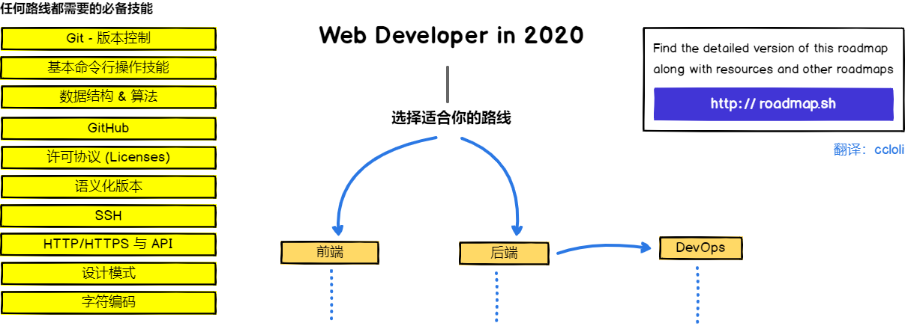
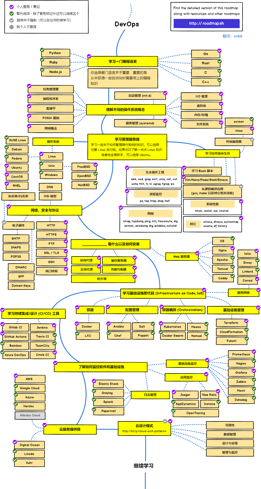

> 2020 年成为 Web 开发工程师之路线图

***

✨ 此项目已在原 repo 中提供 [社区维护的官方中文版本](https://github.com/kamranahmedse/developer-roadmap/tree/master/translations/chinese)，由于此前已有其他用户协助翻译并提交，且本人对后端开发与 DevOps 并不是特别了解，所以这里的翻译暂时不会被合并至原项目中。您可以前往 [原项目](https://github.com/kamranahmedse/developer-roadmap/tree/master/translations/chinese) 查看已翻译的线路图，也可在原项目上提供或改进翻译。此 repo 后续应该还是会按照自己的习惯提供翻译

***

> 译注：本文仅对原文进行原样翻译，文章及图片中提到的个人观点均为原作者之观点。因个人翻译水平有限，翻译文本可能会稍有出入或略带意译。对于可能有明显歧义的地方，会在文后标记英文原文。如果您有翻译改进之建议，欢迎提交 issue 或 PR。提交 issue 与 PR 以改进翻译为主，如果您认为路线图可以改进，建议您向原 repo 提交贡献，谢谢。

> 译注：若您是繁体中文/正体中文使用者，或更倾向于使用台湾的本地化术语，可以查看 [goodjack/developer-roadmap-chinese](https://github.com/goodjack/developer-roadmap-chinese) 维护的版本；若您需要查阅早期的版本，可以查看 [`2019 年版`](https://github.com/ccloli/developer-roadmap-zh-CN/tree/2019-zh-CN)、 [`2018 年版`](https://github.com/ccloli/developer-roadmap-zh-CN/tree/2018-zh-CN)；若您需要查阅该作者之前更早版本的路线图，可以查看 [z-jingjie/developer-roadmap-zh-CN](https://github.com/z-jingjie/developer-roadmap-zh-CN) 维护的版本。

接下来你将会看到一组图表，它们展示了你希望成为前端开发、后端开发或者 devops 领域时可以选择的路线以及技术。这些图表是我为我的一位老教授制作的，他想要分享一些它们的概况给他的大学生；同时将它们分享在这里来回馈社区。

***

		Special Announcement:
		 
		
		 
		<b>We now have a YouTube Channel</b>
		 
		I plan on covering the roadmaps and put more content there <a href="https://www.youtube.com/channel/UCA0H2KIWgWTwpTFjSxp0now?sub_confirmation=1">Subscribe to the channel</a>.

***

<h3 align="center"><strong>这些路线图的目的</strong></h3>

> 这些路线图的目的是让你对这个领域有一个大致的了解，并能在你对接下来要学习什么感到困惑时引导你，而不是鼓励你去学习那些热门和潮流的东西 (what is hip and trendy)。你应该对为什么一个工具在某些场景下比另一个更适合使用有属于自己的理解 (grow some understanding)，并记住热门和潮流永远不意味着它最适合这份工作 (best suited for the job)

<h3 align="center"><strong>初学者注意</strong></h3>

> 这些路线图涵盖了下面列出的所有学习路径。别被吓着了，如果你只是刚开始学习，那么你不需要在一开始就学习所有的内容。我们正在制作这些路线图的初学者版本，并将在 2020 年完成后端与 DevOps 路线图后的不久 [发布](https://roadmap.sh)。

***

如果你觉得这些内容有需要改进的地方，欢迎提出。

## 引言

## 前端路线图

 

## 后端路线图

 

## DevOps 路线图

 

## 🚦 文末唠叨

如果你觉得这些路线图可以改进，欢迎你在 issue 里讨论。此外，我也会继续改进它，所以你可能会想要 watch 这个 repo，或者订阅 [roadmap.sh](http://roadmap.sh) 来回顾。

## 🙌 贡献

> 请浏览 [贡献指南](./CONTRIBUTING.md) 以了解如何更新路线图

- 提交改进的 pull request
- 在 issues 讨论建议
- 分享给大家
- 和我联系提供反馈 
 
## 许可协议

请阅读 [许可协议文件](./LICENSE) 以了解详情
