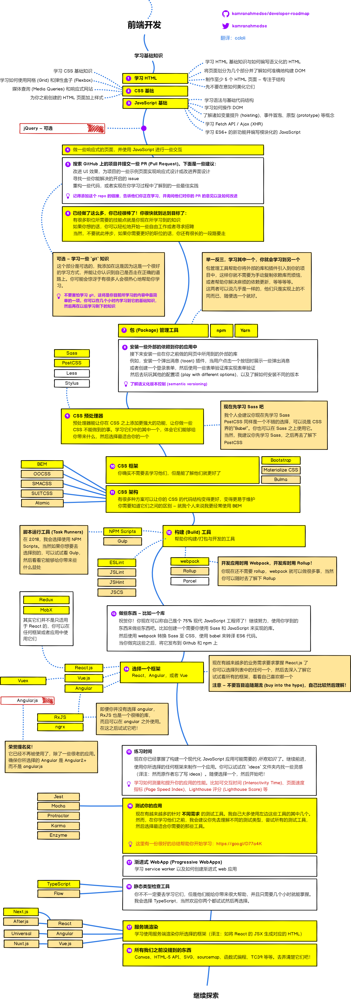
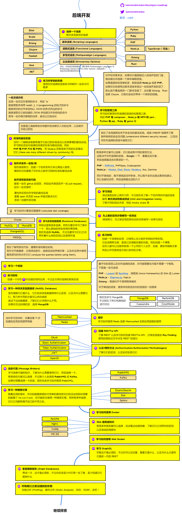
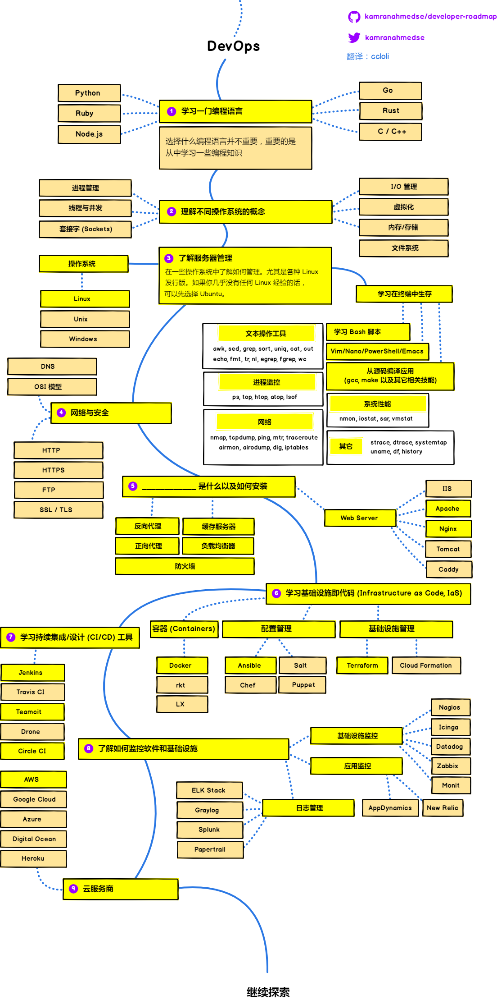

> 在 2018 年成为 Web 开发工程师之路线图

> 译注：本文仅对原文进行原样翻译，文章及图片中提到的个人观点均为原作者之观点。因个人翻译水平有限，翻译文本可能会稍有出入或略带意译。对于可能有明显歧义的地方，会在文后标记英文原文。如果您有翻译改进之建议，欢迎提交 issue 或 PR。提交 issue 与 PR 以改进翻译为主，如果您认为路线图可以改进，建议您向原 repo 提交贡献，谢谢。

接下来你将会看到一组图表，它们展示了成为前端开发、后端开发或者 devops 时可以选择的路线以及技术。这些图表是我为我的一位老教授制作的，他想要分享一些关于它们的概况给他的大学生们。

Check out my [blog](http://kamranahmed.info) and say "hi" on [Twitter](https://twitter.com/kamranahmedse).

## 声明

> 这个路线图的本意是让你对整体有一个大致的了解，并能在当你为接下来需要学习什么而感到困惑时引导你，而不是鼓励你去学习那些时尚和潮流的东西 (what is hip and trendy)。你应该对关于 **为什么一个工具在某些场景下比另一个更适合使用有自己的理解 (grow some understanding)，并记住时尚和潮流永远不意味着它最适合这份工作 (best suited for the job)**

## 🚀 介绍

## 🎨 前端路线图

## 👽 后端路线图

## 👷 DevOps 路线图

## 🚦 文末唠叨

如果你觉得这些路线图可以改进，欢迎开一个包含任何更新的 PR 或提交 issue。同样，我也会继续改进它，所以你可能会想要 watch 或者 star 这个 repo 来关注更新。

> 译注：本 repo 中提交 issue 与 PR 以改进翻译为主。如果您认为路线图可以改进，请向原 repo 提交贡献，谢谢。

## ☑ TODO

- [X] 添加前端路线图
- [X] 添加后端路线图
- [X] 添加 DevOps 路线图
- [ ] 为每个路线图添加相关资源

## 👬 贡献

路线图使用 [Balsamiq](https://balsamiq.com/products/mockups/) 构建。项目文件可以在 `/project` 文件夹找到。要修改路线图，打开 Balsamiq，点击 **Project > Import > Mockup JSON**，路线图将展现在你眼前，修改它，上传并修改 README 中的图片，然后提交 PR。

- 提交改进的 pull request
- 在 issues 讨论建议
- 分享给大家
- 和我联系提供反馈 

## 赞助

- [Hackr.io - Find & Share the Best Online Programming Courses & Tutorials](https://hackr.io)

## 许可协议

